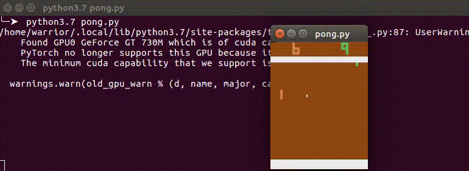

# DQN Algorithm for Solving Atari Pong




## :scroll: About
Implementing Duel Double DQN algorithm with Pytorch to solve OpenAI GYM Atari Pong environment. This implementation learns to play just in 900 episodes. It can take some hours to train from zero. I add 900th episode if you want to test. For testing make it ```SAVE_MODELS = False ``` and ```LOAD_MODEL_FROM_FILE = True``` and ```LOAD_FILE_EPISODE = 900``` and ```MODEL_PATH = "./models/pong-cnn-"```.

## :chart_with_upwards_trend: Results


## ⚙ Usage
To run this code youu have to change model save and terminal output save path. You will find parameters at the very beginning of the code.

## :twisted_rightwards_arrows: Using w/ Different Environment
You can use this implementation for different environment. But because pong environments states consist from screen shot images there is a image preprocess section that resize, greyscale and cut the image. Check out the agent class definition and you will find cut dimensions(in px) and change it for new environment. You can use ```cv2.imshow``` in preprocess function to see how image cut.

## :orange_book: Using in Colab
Just open a new colab(GPU) environment. To save your models add connect your drive to colab and copy the code to one cell. Lastly change the save path and point it to your drive like ```MODEL_SAVE_PATH = "/content/drive/My Drive/pong-models/pong-cnn-"```
