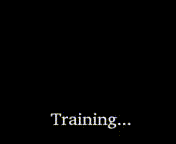
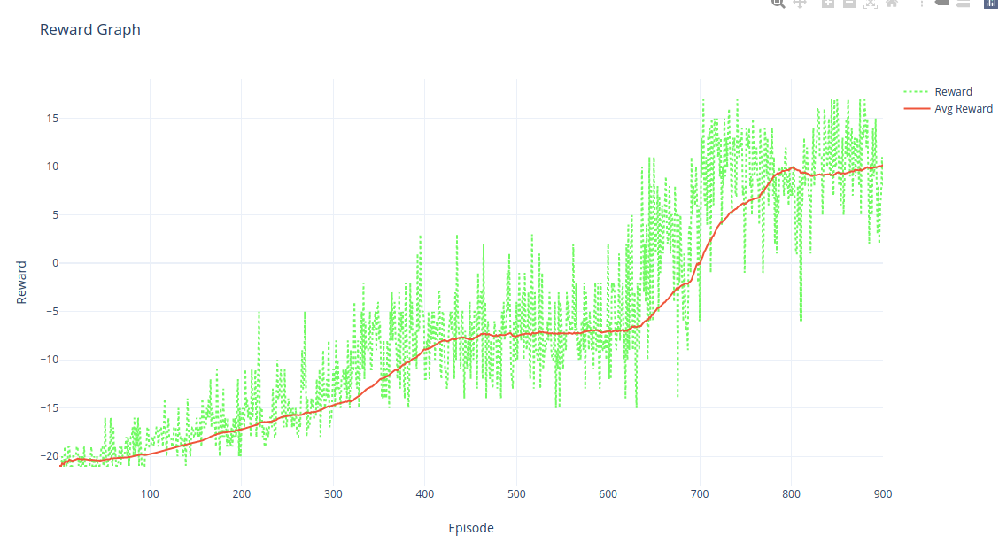
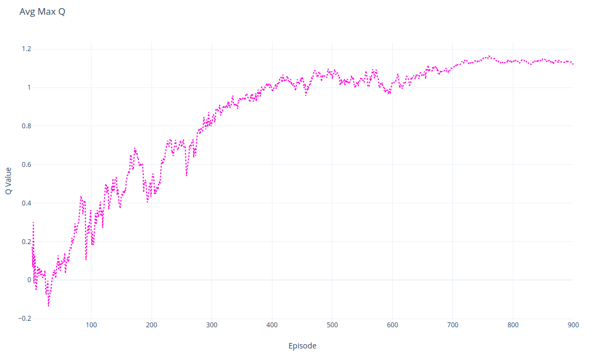

# DQN Algorithm for Solving Atari Pong


[](https://colab.research.google.com/github/bhctsntrk/OpenAIPong-DQN/blob/master/OpenAIPong_DQN.ipynb)




## :scroll: About
Implementing the Duel Double DQN algorithm with Pytorch to solve the OpenAI GYM Atari Pong environment. This implementation learns to play just in 900 episodes. It takes ~7 hours to train from zero in Google Colab. I add the 900th episode if you want to test. For testing make it ```SAVE_MODELS = False ``` and ```LOAD_MODEL_FROM_FILE = True``` and ```LOAD_FILE_EPISODE = 900``` and ```MODEL_PATH = "./models/pong-cnn-"```.

## :chart_with_upwards_trend: Results
These graphs show the training results for 900 episodes.

</img>
</img> 

## ⚙ Usage
First create a Python3 environment. Then install these libraries with pip:

* torch
* gym[atari]
* opencv-python

then check parameters at the very beginning of the code. You will find their descriptions as comment lines.
After editing the parameters just run the ```python3 pong.py```

## :twisted_rightwards_arrows: Using w/ Different Environment
You can use this implementation for a different environment. But there are some parameters that you have to change in the agent class definition. This code uses CNN network because Pong environment returns images as states. So there are an image preprocess function in code that cut the image to get rid score table. Cut dimensions can be found in the Agent Class definition. Use ```cv2.imshow``` in the preprocess function to see and adjust cutting.

You can also turn off greyscaling process from preprocess function. But you have to modify CNN network because input image channels will change.

## :orange_book: Using in Colab
There is two way to do this:
* Just click the Open In Colab badge above.
* Open a new colab(GPU) environment. To save your models connect your drive to colab and copy the pong code into a one cell. Lastly change the save path and point it to your drive like ```MODEL_SAVE_PATH = "/content/drive/My Drive/pong-models/pong-cnn-"``` and run.

## :spiral_notepad: References
[Playing Atari with Deep Reinforcement Learning](https://www.cs.toronto.edu/~vmnih/docs/dqn.pdf)
